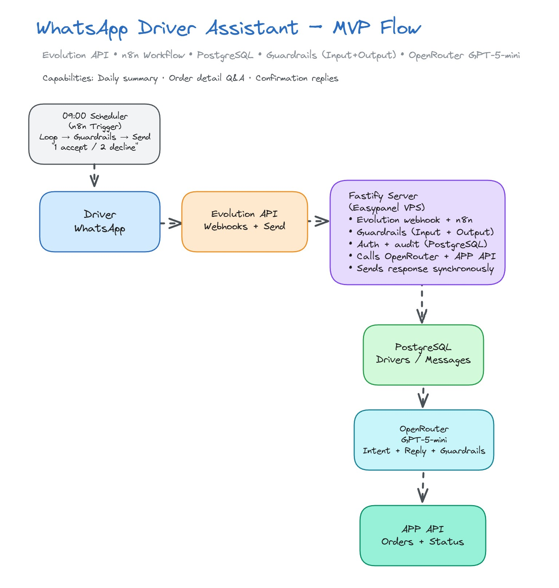

# MVP Architecture: Simple & Direct

**Design approach for rapid validation with 1-50 drivers**

A minimal viable product architecture for WhatsApp-based driver communication. No queues, no workers, no complexity—just a single server handling everything synchronously.

---

## Architecture Overview

**Visual Diagram:** `whatsapp-driver-architecture-MVP.excalidraw`

**Flow (7 Steps):**
1. Driver sends or receives a WhatsApp message via Evolution API.
2. Evolution API webhook triggers the n8n workflow.
3. n8n looks up the driver in PostgreSQL and applies **input guardrails** (prompt injection, profanity, sensitive data).
4. n8n saves the raw message and metadata to PostgreSQL (full audit trail).
5. n8n calls OpenRouter (`gpt-5-mini`) via an AI Agent to classify intent  
   (`accept`, `decline`, `nextOrder`, `humanHelp`, `orderConfirm`, `unknown`) and extract any `order_ref`.
6. Based on intent, n8n fetches data from the APP API (orders today, next order, confirm order), notifies dispatch, or runs a RAG clarification flow.
7. n8n applies **output guardrails** (mask PII, strip URLs), sends the WhatsApp response via Evolution API, and logs the outgoing message.

### Supported Driver Actions
- **Morning check-in:** 09:00 broadcast with personalized summary and "Reply 1 to accept or 2 to decline".
- **Accept all deliveries:** AI interprets acceptance, fetches today’s orders, generates a short route summary, sends confirmation, and logs it.
- **Decline route:** AI classifies decline, notifies dispatch via webhook/email, replies to the driver, and records the decline reason.
- **Next order details:** Driver asks “What’s my next order?”; n8n calls the APP API, AI formats time/address/instructions, sends a concise answer, and logs it.
- **Per-order / delivery confirmation:** Driver can confirm a specific order or delivery (e.g., “confirm order 3”, “delivery for stop 2 done”); n8n calls the APP API to mark it confirmed, sends a confirmation message, and logs the action.
- **Talk with human:** Driver requests help; n8n raises a high-priority dispatch notification and sends a confirmation back to the driver.
- **Clarification with RAG:** For unclear messages, n8n uses driver history + FAQ embeddings (pgvector) to generate a helpful clarification before asking the driver to choose or rephrase.
- **Security & Compliance:** Every inbound and outbound message flows through guardrails and is stored in PostgreSQL for auditability.

---

## Design Decisions & Rationale

### 1. Evolution API for WhatsApp

**Decision:** Use open-source Evolution API.

**Alternatives:** Waha / uazapi

**Why Evolution API for MVP:**
- **No Meta Business Verification:** Skip weeks/months of Meta approval process
- **Zero Message Costs:** No per-message fees
- **Self-Hosted Control:** Deploy on your own infrastructure via Easypanel
- **Instant Setup:** Connect via QR code in minutes, no business verification
- **Full API Access:** REST API for sending/receiving messages
- **Multi-Instance:** Can run multiple WhatsApp numbers on same server

**Why NOT WhatsApp API or paid services like Twilio or Infoblip for MVP:**
- Requires Meta Business verification (2-4 weeks delay)
- Per-message costs add up quickly during testing
- Overkill for prototyping and validation phase
- More expensive for low-volume testing

**Trade-offs:**

**Evolution API Pros:**
- Instant setup (scan QR code)
- Free messaging (no per-message costs)
- Full control over infrastructure
- Good for testing and validation
- Active open-source community

**Evolution API Cons:**
- Uses WhatsApp Web protocol (higher ban risk if abused)
- Not officially supported by Meta
- Less reliable than WhatsApp API or Twilio for production
- No built-in compliance features
- Account can be banned if violating WhatsApp ToS

**When to Upgrade to Twilio:**
- Moving to production with 50+ drivers
- Need official Meta Business API
- Require compliance features (message templates, opt-in management)
- Want reliability guarantees and SLAs
- Have budget for per-message costs

**Risk Mitigation for Evolution API:**
- Respect WhatsApp rate limits (don't spam)
- Only message drivers who opted in
- Keep message volume reasonable during testing
- Have backup plan to migrate to Twilio for production
- Use dedicated phone number (not personal)

---

### 2. Easypanel for Hosting

**Decision:** Self-host on Easypanel instead of using managed platforms. If your team is small and you don’t have a dedicated DevOps engineer, using a PaaS solution like Easypanel is strongly recommended.

**Why Easypanel:**
- **Cost Effective:** One VPS hosts everything (Evolution API + n8n + PostgreSQL + Fastify)
- **Full Control:** Own your infrastructure, no vendor lock-in
- **Docker-Based:** Modern containerized deployments
- **Easy Management:** Visual interface for deploying services

**Typical Easypanel Setup:**
- VPS: Hetzner/DigitalOcean/Linode ($10-20/month)
- Easypanel: Free (self-hosted control panel)
- Services: all on one server

**Trade-offs:**
- Requires basic DevOps knowledge
- You manage server updates and security
- More setup time initially (1-2 hours)
- But: Complete control and lower costs

---

### 3. Fastify Server Framework

**Decision:** Use Fastify for the webhook server and API handling. Fastify is a high-performance framework focused on speed and low overhead.

**Alternatives:** Express, NextJS, Koa, Hono

**Why Fastify for MVP:**
- **Fast Setup:** Single-file server ready in 30 minutes
- **High Performance:** Fastest Node.js framework, critical for real-time messaging
- **Native async/await:** Clean code from day one
- **JSON Schema Validation:** Built-in webhook validation for Evolution API
- **Plugin Architecture:** Easy to add PostgreSQL, Redis when scaling
- **Production-Ready:** Same framework for MVP and Production (zero migration friction)
  
**Trade-offs:**
- Simple to build and maintain
- Team already know Node
- Low operational complexity
- No resilience if server crashes
- Blocks on long API calls
- Cannot scale horizontally easily

**Synchronous Processing:**
All processing happens synchronously in the webhook handler (no workers, no queues).

**Migration Path to Production:**
Same Fastify framework, just refactor into plugins and services. No framework change required when scaling.

**When to upgrade:** When response time exceeds 5 seconds or driver count exceeds 50

---

### 4. PostgreSQL

**Decision:** Use PostgreSQL for both persistence and session state.

**Why:**
- Single database to manage
- Built-in with most hosting platforms (Railway, Heroku)
- pgvector extension that enables store vector embeddings
- Reduces monthly costs
- JSONB columns handle flexible session data

**Trade-offs:**
- Lower cost
- Simpler architecture
- Slower than Redis for session lookups
- No message queuing for async processing
- Limited caching capabilities

**Session Storage Approach:**
Store conversation context directly in PostgreSQL using JSONB columns on the drivers table, eliminating the need for separate session storage infrastructure.

---

### 5. LLM Calls via OpenRouter

**Decision:** Call OpenRouter (gpt-5-mini) via n8n AI Agent nodes on every message without response caching.

**Why:**
- No cache infrastructure needed
- Always fresh responses
- Native n8n integration (no custom code)
- Built-in prompt management via AI Agent nodes
- Cost-effective model for MVP testing

**Trade-offs:**
- Simpler implementation
- Always contextual responses
- Higher per-message costs vs cached approach (but gpt-5-mini is ~20x cheaper than GPT-4)
- Slightly slower than cached responses

**Model Choice (gpt-5-mini):**
- $0.15/$0.60 per 1M tokens (input/output)
- Fast inference (~500ms)
- Good enough for intent classification
- Can upgrade to GPT-4o or Claude for production

**Cost Impact:**
MVP approach accepts higher per-message AI costs in exchange for reduced infrastructure complexity and faster time to market. gpt-5-mini keeps costs reasonable during validation phase (~$2-5/month for 100 drivers).

---

## AI Integration Strategy

### MVP Implementation: n8n AI Agent Nodes + OpenRouter

**Architecture:**
- **n8n AI Agent Nodes:** Native LangChain integration for structured AI workflows
- **OpenRouter Gateway:** Single API for multiple LLM providers
- **gpt-5-mini:** Cost-effective model for MVP validation ($0.15/$0.60 per 1M tokens)

**Three AI Agent Nodes in Workflow:**
1. **AI Agent • Interpret Reply** - Classifies driver response (accept/decline/unknown)
2. **AI Agent • Compose Summary** - Generates friendly order summaries for accepted deliveries
3. **Guardrails Models** - Powers input/output content filtering via OpenRouter

**Benefits:**
- Visual prompt management in n8n UI
- Structured JSON output parsing built-in
- Easy to A/B test different models
- No custom LangChain code needed
- Can export to Fastify/LangChain for production

**Provider Routing:**
- Route to OpenAI via OpenRouter for consistent performance
- No fallback providers (simpler for MVP)
- Acceptable trade-off for testing phase

**Cost Impact:** ~$2-5/month for 100 drivers with gpt-5-mini

---

## Guardrails for AI Safety

### MVP Implementation with n8n Guardrails Nodes

**Two Guardrails Nodes in Workflow:**

1. **Guardrails (Input)** - Protects system from malicious driver input
   - **Position:** After "Save Incoming Message", before "AI Agent"
   - **Rules:** 
     - `block_prompt_injection` - Prevents AI jailbreaks
     - `block_profanity` - Filters inappropriate language
     - `mask_sensitive_data` - Hides phone numbers, emails, etc.
   - **Model:** OpenRouter gpt-5-mini for AI-powered content analysis

2. **Guardrails (Broadcast Output)** - Sanitizes messages before sending to drivers
   - **Position:** After "Compose Morning Message", before "Send Broadcast"
   - **Rules:**
     - `mask_pii` - Protects personally identifiable information
     - `strip_urls` - Removes tracking links and suspicious URLs
   - **Model:** OpenRouter Broadcast Model for output validation

**How It Works:**
- Guardrails nodes use OpenRouter models to analyze content
- Violations are logged and blocked automatically
- Clean content passes through to next step
- Adds ~200-500ms latency per guardrail check

**Benefits:**
- Zero additional infrastructure needed
- Native n8n integration (visual configuration)
- AI-powered detection (not just regex)
- Customizable rules per use case
- Comprehensive audit trail

**Cost Impact:** 
- Included in OpenRouter API calls (~$0.50/month for guardrails)
- No separate guardrails service fees
- Minimal token usage per check

---

## Security Considerations

### Implemented in MVP:
- Driver authentication via phone number
- Message persistence (audit trail)
- Environment variable configuration

### Deferred to Production:
- Twilio signature verification (add in production)
- Rate limiting (add when scaling)
- GDPR compliance features (data retention)

**Rationale:** Focus on core functionality first, add security hardening when scaling.

---

## Prototype Implementation: n8n Workflow

**Available:** `n8n-workflow-mvp.json` (33 nodes with comprehensive guardrails)

**Why n8n for prototyping:**
- Visual workflow builder (faster than coding)
- Built-in Evolution API, OpenRouter, and Guardrails nodes
- Test end-to-end flow in 30 minutes
- Self-hosted option (data privacy)
- Ready-made security policies (Guardrails node)
- Export to Fastify code when scaling to production

**Workflow Architecture:**

### Morning Broadcast Flow (9 nodes)
1. **09:00 Scheduler** - Daily trigger
2. **Fetch Assignments** - Pull today's assignments from APP API
3. **Loop Drivers** - Iterate through each driver
4. **Compose Message** - Create personalized "1 accept / 2 decline" prompt
5. **Guardrails (Broadcast Output)** - Sanitize outgoing messages (mask PII, strip URLs)
6. **Send via Evolution API** - Deliver WhatsApp message
7. **Log Broadcast** - Audit trail in PostgreSQL

### WhatsApp Ingestion Flow (7 nodes)
1. **Evolution Webhook** - Receive driver replies
2. **Parse & Normalize** - Standardize payload structure
3. **Respond 200 OK** - Instant webhook acknowledgment
4. **Driver Lookup** - Authenticate via phone number (PostgreSQL)
5. **Save Incoming Message** - Audit trail (PostgreSQL)
6. **Guardrails (Input)** - Block prompt injection, profanity, sensitive data
7. **AI Agent (OpenRouter gpt-5-mini)** - Interpret driver reply

### Decision Routing & Response (17 nodes)
1. **Parse Decision JSON** - Extract structured decision data
2. **Branch on Decision** - Switch node with 3 outputs:
   - **Accept Flow:** Fetch orders → AI summary → Send acceptance → Log
   - **Decline Flow:** Notify dispatch → Send confirmation → Log
   - **Clarify Flow:** Request clear response
3. **Multiple OpenRouter Models** - Decision, Summary, and Guardrail models
4. **PostgreSQL Logging** - All actions logged for compliance

**Security Features:**
- ✅ **Input Guardrails:** Block prompt injection, filter profanity, mask sensitive data
- ✅ **Output Guardrails:** Mask PII before sending, strip tracking URLs
- ✅ **AI-Powered Filtering:** OpenRouter models power content analysis
- ✅ **Comprehensive Audit Trail:** All messages logged to PostgreSQL
- ✅ **Driver Authentication:** Phone-based verification

---

## Summary

**MVP Architecture Prioritizes:**
1. **Speed to Market**: Deploy in hours, not days with n8n visual workflow
2. **Cost Efficiency**: ~$15-25/month for 100 drivers
   - VPS hosting: $10-15/month (Hetzner/DigitalOcean)
   - PostgreSQL: $0 (included in VPS)
   - OpenRouter API: $2-5/month (gpt-5-mini)
   - Evolution API: $0 (self-hosted)
   - n8n: $0 (self-hosted)
3. **Simplicity**: Visual workflow, minimal coding, single server
4. **Security Built-in**: Guardrails for input/output protection
5. **Migration Path**: Clear upgrade to Fastify+RabbitMQ for production

**Acceptable Trade-offs:**
- Lower uptime vs production infrastructure
- Synchronous processing (slower for high volume)
- Limited to ~50 concurrent drivers
- Manual operations (no auto-scaling)
- WhatsApp ban risk with Evolution API

**Best For:** 
- Proof of concept with real drivers
- Early validation before production investment
- Learning and iterating on UX
- Budget-conscious startups
- Fast market testing

**When to Graduate to Production:**
- Consistent 50+ active drivers
- Need very high uptime SLA
- Response time consistently >5 seconds
- Require WhatsApp Business API compliance
- Budget available for infrastructure scaling

---

## Related Documentation

- **[README.md](./README.md)** - Overview and architecture comparison
- **[README_PRODUCTION.md](./README_PRODUCTION.md)** - Production architecture
- **[whatsapp-driver-architecture-MVP.excalidraw](./whatsapp-driver-architecture-MVP.excalidraw)** - Visual diagram
- **[n8n-workflow-mvp.json](./n8n-workflow-mvp.json)** - Working n8n MVP workflow
- **[MVP-FLOW.jpg](./MVP-FLOW.jpg)** - MVP flow diagram
- **[n8n-workflow-mvp.jpg](./n8n-workflow-mvp.jpg)** - n8n workflow screenshot with all nodes and guardrails

---
